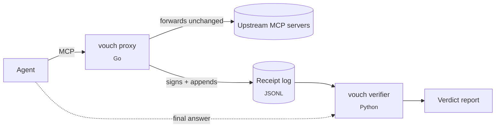

# vouch

**Every number, vouched for.** A verification layer for tool-using LLM agents: every tool call gets a signed receipt, and every numeric claim in the agent's answer is audited against those receipts.

[](https://github.com/jma49/vouch/actions/workflows/ci.yml)
[](LICENSE)


---

## The failure it catches

The tool returns `last = 172.04`. The agent writes *"AMD last traded at 172.40."*

The sentence is fluent, plausible, and wrong. LLM-as-judge and semantic-similarity evals do not catch it, because nothing about it *reads* wrong. It is only wrong relative to what the tool said, and once the market moves, what the tool said is gone.

vouch answers exactly one question: **is the number the agent just said actually a number its tools returned?**

## What it looks like

An agent answer, audited against the receipts its tool calls produced
(`vouch-verify --answer examples/answer.txt --receipts testdata/receipts_golden.jsonl`):

<!-- BEGIN GENERATED example-report: do not edit; run `make readme` -->
```text
NVDA's RSI(14) is 62 [[r:golden-0#/rsi_14]], and the stock closed at 181.52. AMD is down 1.35% on the day. AMD last traded at 172.40. NVDA volume was 41,200,000 shares. AMD's P/E sits near 48.
```

| Claim | Verdict | Receipted value | Receipt | Note |
|---|---|---|---|---|
| `62` | **SUPPORTED** | 62.3 | golden-0 |  |
| `181.52` | **SUPPORTED** | 181.52 | golden-0 |  |
| `1.35%` | **SUPPORTED** | -1.35 | golden-1 |  |
| `172.40` | **CONTRADICTED** | 172.04 | golden-1 | closest receipted value is 172.04 |
| `41,200,000` | **UNSUPPORTED** |  |  | no receipt covers (NVDA, volume) |
| `48` | **UNVERIFIABLE** |  |  | no entity/metric resolution (Tier 3 not enabled) |
<!-- END GENERATED example-report -->

Rounding `62.3` to `62` is not a hallucination, and neither is writing a negative change as *"down 1.35%"*. Swapping two digits of a price is. A volume figure no tool returned is flagged as fabricated, and a claim outside the verifier's scope is reported as such rather than guessed at.

## How it works



1. **Record.** The proxy is a federating MCP server: the agent connects to it instead of to its upstreams. Every `tools/call` is forwarded unchanged and written as a canonicalized, signed receipt. It sits on the only path where ground truth exists, so neither the agent nor the upstream has to cooperate.
2. **Extract.** Per-tool YAML schemas map JSON pointers in each result to typed facts (`entity`, `metric`, `value`, `as_of`, tolerance class) at write time. Adding a tool means adding config, not code.
3. **Judge.** The verifier pulls numeric claims out of the answer, from explicit citations (`[[r:<receipt>#/json/ptr]]`) first and a deterministic scan second, matches each against receipted facts, and assigns a verdict.

## Verdicts

| Verdict | Meaning | Status |
|---|---|---|
| `SUPPORTED` | A matching fact exists and the value is within tolerance | ✅ |
| `CONTRADICTED` | A matching fact exists and the value is outside tolerance: *the deadly class* | ✅ |
| `UNSUPPORTED` | No receipt covers the claim: fabricated from parametric memory | ✅ |
| `UNVERIFIABLE` | Out of scope or unresolvable, and counted rather than guessed | ✅ |
| `STALE` | Matches only a fact from outside the claim's time window: true once, not for the date claimed | ✅ |
| `DERIVED` | Recomputable from receipts via whitelisted operations only | planned |

Fabrication and contradiction are different failures with different fixes, so vouch never collapses them into a single "hallucination" bit.

## Measured results

> [!IMPORTANT]
> These numbers measure **detection of known mutation shapes** (digit swaps, sign flips, entity swaps, ...) on a **synthetic gold set** whose clean answers come from templates aligned with the verifier's own extractor. They are a regression signal, not a claim about accuracy on real agent output, and the variance is zero by construction because no LLM is in the loop. A human-labeled evaluation over real agent runs is [roadmap Phase 2](docs/roadmap.md#phase-2--a-real-evaluation-the-headline).

<!-- BEGIN GENERATED eval-metrics: do not edit; run `make readme` -->
Gold set: 11 cases per run (2 clean, 9 mutants), derived from 5 facts in 3 receipts. N = 10 runs.

| Metric | Mean ± std | 95% bootstrap CI |
|---|---|---|
| Mutation detection rate | 0.89 ± 0.00 | [0.89, 0.89] |
| False-positive rate on clean answers | 0.00 ± 0.00 | [0.00, 0.00] |
| Claim coverage (non-`UNVERIFIABLE`) | 1.00 ± 0.00 | [1.00, 1.00] |
| Tier 1 (cited) share of claims | 0.46 ± 0.00 | [0.46, 0.46] |

| Mutation | Recall | 95% bootstrap CI |
|---|---|---|
| `digit_swap` | 1.00 | [1.00, 1.00] |
| `magnitude_shift` | 1.00 | [1.00, 1.00] |
| `entity_swap` | 1.00 | [1.00, 1.00] |
| `sign_flip` | 1.00 | [1.00, 1.00] |
| `fabricated_citation` | 1.00 | [1.00, 1.00] |
| `false_absence` | 0.00 | [0.00, 0.00] |
<!-- END GENERATED eval-metrics -->

`false_absence` stays at 0.00 on purpose. An answer that omits a fact produces no claim to judge, and the table reports that gap rather than dropping the row. Every number in this section is regenerated by `make readme`, and CI fails if the README drifts from what the code produces.

## Engineering principles

- **Fail closed.** If a receipt cannot be written, the tool call fails. vouch never passes through data it could not later verify.
- **Byte-identical across languages.** Go writes receipts and Python verifies them. Canonical JSON is pinned by shared test vectors, and a CI job regenerates the Go-written golden log and fails on any drift.
- **Rounding is not hallucination.** Tolerance is a versioned policy (`tolerance.yaml`) with per-class absolute, relative, and display-rounding slack, and it is printed in every report. An unknown class falls back to exact comparison, so a typo tightens verification and never loosens it.
- **Distributions, not points.** Evals run N ≥ 2 times and report mean, spread, and bootstrap CIs. The CLI refuses to print a single-run score.
- **Deterministic replay.** Upstream responses are recorded once, content-addressed by `hash(tool, canonical_args)`, and replayed offline on a logical clock. Business logic never reads the wall clock directly.
- **Honest numbers.** Metrics are generated, not typed. Known gaps are listed below and in [`docs/pitfalls.md`](docs/pitfalls.md) instead of being left for a reviewer to find.

## Quickstart

```bash
make build        # Go proxy -> proxy/bin/vouch
make install-py   # verifier + harness into verifier/.venv

export VOUCH_HMAC_KEY="$(openssl rand -hex 32)"

# 1. Put the proxy in front of your upstream MCP server(s),
#    and point your agent at this process instead.
./proxy/bin/vouch proxy \
    --upstream "uvx some-market-data-mcp" \
    --receipts ./receipts --schemas ./schemas

# 2. Audit the agent's final answer against the receipts it produced.
#    Exits 1 if any claim is CONTRADICTED, UNSUPPORTED, or STALE.
vouch-verify --answer answer.txt \
    --receipts ./receipts/receipts.jsonl --tolerances tolerance.yaml

# 3. Measure the verifier against machine-generated known-bad answers.
vouch-eval --receipts ./receipts/receipts.jsonl --n 10
```

Record once, then replay deterministically with no network access:

```bash
./proxy/bin/vouch proxy --mode=record --upstream "..." --fixtures ./fixtures ...
./proxy/bin/vouch proxy --mode=replay --fixtures ./fixtures ...
```

A Docker image carrying the whole pipeline is available via `docker compose run --rm proxy|verify|eval`; see [`docker-compose.yml`](docker-compose.yml).

## Known limitations

vouch is an MVP. The most consequential gaps, each tracked with a reproduction in [`docs/pitfalls.md`](docs/pitfalls.md):

- **Free-text extraction is shallow.** The deterministic scan can misread dates as values, ignores magnitude words (*"12 million"*), and attributes claims to the nearest entity by character distance.
- **Signatures are symmetric.** HMAC gives tamper evidence to key holders, not public verifiability, and the log has no hash chain yet, so deleted lines go undetected.
- **Canonicalization is literal-preserving, not RFC 8785.** It is consistent across Go and Python, but `62.30` and `62.3` digest differently.
- **The proxy serves one request at a time** and does not yet forward server-to-client requests or cancellation.

## Roadmap

Measurement before features. Full plan with exit criteria in [`docs/roadmap.md`](docs/roadmap.md).

| Phase | Focus | Status |
|---|---|---|
| 0 | Hygiene: lint, strict typing, race detector, generated metrics | done |
| 1 | Verifier correctness on real prose | next |
| 2 | Real evaluation: human-labeled claims from multiple models | planned |
| 3 | Integrity: Ed25519, hash-chained log, tamper suite | planned |
| 4 | RFC 8785 canonicalization with cross-language differential fuzzing | planned |
| 5 | Proxy protocol completeness and latency benchmarks | planned |

## Repository layout

| Path | Language | Role |
|---|---|---|
| [`proxy/`](proxy) | Go | Federating MCP proxy, receipt signing, fixture record/replay |
| [`verifier/`](verifier) | Python | Claim extraction, fact matching, verdicts, `vouch-verify` |
| [`harness/`](harness) | Python | Mutation injection, gold set, repeated-run eval, `vouch-eval` |
| [`schemas/`](schemas) | YAML | Per-tool fact-extraction configs |
| [`testdata/`](testdata) | JSON | Cross-language canonicalization vectors, Go-written golden receipt log |
| [`examples/`](examples) | text | The answer audited above |
| [`docs/`](docs) | Markdown | [Design](docs/design.md), [roadmap](docs/roadmap.md), [pitfalls](docs/pitfalls.md) |

## Development

```bash
make test     # go vet + go test -race, then both Python suites
make lint     # gofmt, go vet, ruff, mypy --strict
make cover    # coverage report for Go and Python
make readme   # regenerate the measured sections of this README
make golden   # regenerate the Go-written golden receipt log
```

Contribution rules for humans and coding agents alike (invariants, commit conventions, which docs to keep current) live in [`AGENTS.md`](AGENTS.md).

## Non-goals

Read-only and research-only. There is no order execution, no brokerage credential, and no trading capability, ever. vouch does not rebuild market data (upstreams are dependencies, not competition) and makes no return or Sharpe claims. It is infrastructure, not alpha.

## License

[MIT](LICENSE)
