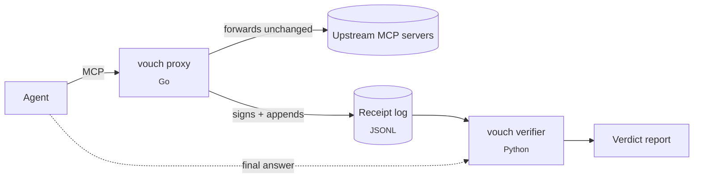

# vouch

**Every number, vouched for.** A verification layer for tool-using LLM agents: every tool call gets a signed receipt, and every numeric claim in the agent's answer is audited against those receipts.

[](https://github.com/jma49/vouch/actions/workflows/ci.yml)
[](LICENSE)


---

## The failure it catches

The tool returns `last = 172.04`. The agent writes *"AMD last traded at 172.40."*

The sentence is fluent, plausible, and wrong. LLM-as-judge and semantic-similarity evals do not catch it, because nothing about it *reads* wrong. It is only wrong relative to what the tool said, and once the market moves, what the tool said is gone.

vouch answers exactly one question: **is the number the agent just said actually a number its tools returned?**

## What it looks like

An agent answer, audited against the receipts its tool calls produced
(`vouch-verify --answer examples/answer.txt --receipts testdata/receipts_golden.jsonl`):

<!-- BEGIN GENERATED example-report: do not edit; run `make readme` -->
```text
NVDA's RSI(14) is 62 [[r:golden-0#/rsi_14]], and the stock closed at 181.52 on July 24. AMD is down 1.35% on the day and is trading at 172.40. NVDA volume was 41.2 million shares. AMD's P/E sits near 48, roughly 3x its sector.
```

| Claim | Verdict | Receipted value | Receipt | Note |
|---|---|---|---|---|
| `62` | **SUPPORTED** | 62.3 | golden-0 |  |
| `181.52` | **SUPPORTED** | 181.52 | golden-0 |  |
| `1.35%` | **SUPPORTED** | -1.35 | golden-1 |  |
| `172.40` | **CONTRADICTED** | 172.04 | golden-1 | closest receipted value is 172.04 |
| `41.2 million` | **UNSUPPORTED** |  |  | no receipt covers (NVDA, volume) |
| `48` | **UNVERIFIABLE** |  |  | no entity/metric resolution (Tier 3 not enabled) |
| `3x` | **UNVERIFIABLE** |  |  | a multiplier is not a point value |
<!-- END GENERATED example-report -->

Rounding `62.3` to `62` is not a hallucination, and neither is writing a negative change as *"down 1.35%"*. Swapping two digits of a price is. The date is recognized as a date and not as a claim. The percentage is judged as a day change even though *"trading at"* sits right next to it, because a percentage cannot be a price. *"41.2 million"* is read at its own precision and flagged as fabricated, since no tool returned it. A P/E and a multiplier are out of scope, and the report says so rather than guessing.

## How it works



1. **Record.** The proxy is a federating MCP server: the agent connects to it instead of to its upstreams. Every `tools/call` is forwarded unchanged and written as a canonicalized, signed receipt. It sits on the only path where ground truth exists, so neither the agent nor the upstream has to cooperate.
2. **Extract.** Per-tool YAML schemas map JSON pointers in each result to typed facts (`entity`, `metric`, `value`, `as_of`, tolerance class) at write time. Adding a tool means adding config, not code.
3. **Judge.** The verifier pulls numeric claims out of the answer, from explicit citations (`[[r:<receipt>#/json/ptr]]`) first and a deterministic scan second, matches each against receipted facts, and assigns a verdict.

## Verdicts

| Verdict | Meaning | Status |
|---|---|---|
| `SUPPORTED` | A matching fact exists and the value is within tolerance | ✅ |
| `CONTRADICTED` | A matching fact exists and the value is outside tolerance: *the deadly class* | ✅ |
| `UNSUPPORTED` | No receipt covers the claim: fabricated from parametric memory | ✅ |
| `UNVERIFIABLE` | Out of scope or unresolvable, and counted rather than guessed | ✅ |
| `STALE` | Matches only a fact from outside the claim's time window: true once, not for the date claimed, or, in a backtest (`--as-of`), data the agent could not yet have had | ✅ |
| `DERIVED` | Recomputable from receipts via whitelisted operations only | planned |

Fabrication and contradiction are different failures with different fixes, so vouch never collapses them into a single "hallucination" bit.

## Measured results

> [!IMPORTANT]
> These numbers measure **detection of known mutation shapes** (digit swaps, sign flips, entity swaps, ...) on a **synthetic gold set** whose clean answers come from templates aligned with the verifier's own extractor. They are a regression signal, not a claim about accuracy on real agent output, and the variance is zero by construction because no LLM is in the loop. A human-labeled evaluation over real agent runs is [roadmap Phase 2](docs/roadmap.md#phase-2--a-real-evaluation-the-headline).

<!-- BEGIN GENERATED eval-metrics: do not edit; run `make readme` -->
Gold set: 11 cases per run (2 clean, 9 mutants), derived from 5 facts in 3 receipts. N = 10 runs.

| Metric | Mean ± std | 95% bootstrap CI |
|---|---|---|
| Mutation detection rate | 0.89 ± 0.00 | [0.89, 0.89] |
| False-positive rate on clean answers | 0.00 ± 0.00 | [0.00, 0.00] |
| Claim coverage (non-`UNVERIFIABLE`) | 1.00 ± 0.00 | [1.00, 1.00] |
| Tier 1 (cited) share of claims | 0.46 ± 0.00 | [0.46, 0.46] |

| Mutation | Recall | 95% bootstrap CI |
|---|---|---|
| `digit_swap` | 1.00 | [1.00, 1.00] |
| `magnitude_shift` | 1.00 | [1.00, 1.00] |
| `entity_swap` | 1.00 | [1.00, 1.00] |
| `sign_flip` | 1.00 | [1.00, 1.00] |
| `fabricated_citation` | 1.00 | [1.00, 1.00] |
| `false_absence` | 0.00 | [0.00, 0.00] |
<!-- END GENERATED eval-metrics -->

`false_absence` stays at 0.00 on purpose. An answer that omits a fact produces no claim to judge, and the table reports that gap rather than dropping the row. Every number in this section is regenerated by `make readme`, and CI fails if the README drifts from what the code produces.

## Real-agent evaluation

The synthetic numbers above are a regression check. The headline measurement is real models answering real questions through the proxy, scored against human labels. The pipeline is built and tested; runs and labels are being collected ([roadmap Phase 2](docs/roadmap.md)).

```bash
make agent MODEL=gemini-flash ARGS=--dry-run   # plan: runs pending, estimated requests
make agent MODEL=gemini-flash                   # run 30 tasks x 5 samples (cached, resumable)
vouch-label serve --labeler <you>               # blind labeling UI on 127.0.0.1
make eval-real                                  # verifier vs. labels, misreport rate per model
```

- **Any OpenAI-compatible model** is a config entry in [`eval/models.yaml`](eval/models.yaml): Gemini, OpenAI, Anthropic, DeepSeek, OpenRouter, or a local Ollama/vLLM.
- **Deterministic upstream.** A synthetic market-data MCP server serves real tickers with generated values. Runs are reproducible, and a model that recalls real-world prices instead of reading the tool gets caught.
- **Pay once.** Every model response is cached by request hash, and completed runs are skipped.
- **Blind labels.** The labeling tool never shows the verifier's verdict. [`docs/labeling.md`](docs/labeling.md) defines every label, and agreement between labelers is reported as Cohen's kappa.
- **Citation as a measured condition.** With `ARGS=--cite`, the proxy (`vouch proxy --cite`) appends each result's receipted values with a ready-made citation, such as `rsi_14 = 62.3  -> [[r:3f9a1c2e7b40#/rsi_14]]`, and the model is asked to use them. Those runs are kept under `<model>+cite`, and the report states how often each model actually cites (Tier 1 adherence).

## Beyond finance

Nothing in the proxy or the verifier knows what a stock is. A domain supplies two files: a schema that says which fields of a tool's result are facts, and whose and when they are, and a vocabulary that says how prose names those metrics. [`examples/analytics`](examples/analytics) points vouch at an agent that answers business questions by writing SQL against a sales database. It uses the same proxy and the same verifier with `--vocabulary examples/analytics/vocabulary.yaml`, and an end-to-end test shows every verdict class working there.

## Overhead

<!-- BEGIN GENERATED latency: do not edit; run `make bench` -->
Measured by `make bench` on Apple M1 Pro (darwin/arm64, 8 CPUs, go1.27.1): 5000 sequential `tools/call`s against an in-memory upstream, so the numbers are the proxy's own cost.

| Path | p50 | p99 |
|---|---|---|
| Agent to upstream, direct | 6.6 µs | 14.4 µs |
| Agent to upstream, through vouch | 4.89 ms | 8.02 ms |
| of which: signed, fsynced log append | 4.08 ms | 7.59 ms |
<!-- END GENERATED latency -->

Most of it is the fsync that makes each receipt durable before the agent sees the result: a call whose receipt cannot be written fails instead (invariant 2 in [`AGENTS.md`](AGENTS.md)). That cost belongs to the storage, so it varies by file system and disk; run `make bench` on your own hardware. Appends are serialized, one fsync each, so under concurrent load receipts queue on the disk; batching them (group commit) is not built.

## Engineering principles

- **Fail closed.** If a receipt cannot be written, the tool call fails. vouch never passes through data it could not later verify.
- **Byte-identical across languages.** Go writes receipts and Python verifies them. Canonical JSON is pinned by shared test vectors, and a CI job regenerates the Go-written golden log and fails on any drift.
- **Rounding is not hallucination.** Tolerance is a versioned policy (`tolerance.yaml`) with per-class absolute, relative, and display-rounding slack, and it is printed in every report. An unknown class falls back to exact comparison, so a typo tightens verification and never loosens it.
- **Distributions, not points.** Evals run N ≥ 2 times and report mean, spread, and bootstrap CIs. The CLI refuses to print a single-run score.
- **Deterministic replay.** Upstream responses are recorded once, content-addressed by `hash(tool, canonical_args)`, and replayed offline on a logical clock. Business logic never reads the wall clock directly.
- **Honest numbers.** Metrics are generated, not typed. Known gaps are listed below and in [`docs/pitfalls.md`](docs/pitfalls.md) instead of being left for a reviewer to find.

## Quickstart

```bash
make build        # Go proxy -> proxy/bin/vouch
make install-py   # verifier + harness into verifier/.venv

# 0. Create a signing key. Keep vouch.pem private; share vouch.pub.pem.
./proxy/bin/vouch keygen --out ~/.vouch

# 1. Put the proxy in front of your upstream MCP server(s),
#    and point your agent at this process instead.
./proxy/bin/vouch proxy --signing-key ~/.vouch/vouch.pem \
    --upstream "uvx some-market-data-mcp" \
    --receipts ./receipts --schemas ./schemas

# 2. Audit the agent's final answer against the receipts it produced.
#    Exits 1 if any claim is CONTRADICTED, UNSUPPORTED, or STALE.
vouch-verify --answer answer.txt --public-key ~/.vouch/vouch.pub.pem \
    --receipts ./receipts/receipts.jsonl --tolerances tolerance.yaml
#    --format html > report.html   one page, every number marked by verdict
#    --as-of 2026-07-20            a backtest: flag data the agent could not yet have had

# 3. Measure the verifier against machine-generated known-bad answers.
vouch-eval --receipts ./receipts/receipts.jsonl --n 10 --public-key ~/.vouch/vouch.pub.pem

# Anyone with the public key can check the log, and read it:
./proxy/bin/vouch receipts verify --public-key ~/.vouch/vouch.pub.pem ./receipts/receipts.jsonl
./proxy/bin/vouch receipts cat ./receipts/receipts.jsonl | jq .

# The canonical form any digest in a receipt is computed over:
echo '{"b": 1.50, "a": [1e2]}' | ./proxy/bin/vouch canon    # {"a":[1e2],"b":1.50}
```

Upstreams can be remote, and the agent can reach the proxy over HTTP instead of stdio (MCP's Streamable HTTP transport):

```bash
export MARKET_TOKEN=...   # read by name, so it never appears in the process list
./proxy/bin/vouch proxy --signing-key ~/.vouch/vouch.pem --listen 127.0.0.1:8765 \
    --upstream "market=https://mcp.example.com/mcp" \
    --upstream-header "market=Authorization: env:MARKET_TOKEN" \
    --receipts ./receipts --schemas ./schemas
# point the agent at http://127.0.0.1:8765/mcp; ending the session (DELETE) or Ctrl-C seals the log
```

Record once, then replay deterministically with no network access:

```bash
./proxy/bin/vouch proxy --mode=record --upstream "..." --fixtures ./fixtures ...
./proxy/bin/vouch proxy --mode=replay --fixtures ./fixtures ...
```

A Docker image carrying the whole pipeline is available via `docker compose run --rm proxy|verify|eval`; see [`docker-compose.yml`](docker-compose.yml).

## Known limitations

vouch is an MVP. The most consequential gaps, each tracked with a reproduction in [`docs/pitfalls.md`](docs/pitfalls.md):

- **Extraction is deterministic, English-only, and keyword-driven.** It handles dates, magnitudes, units, signs (including Unicode minus and accounting parentheses), clause structure, markdown tables and lists, and pronouns that open a sentence, measured by a 166-case adversarial corpus and property-based tests. It does not do general coreference, it reads a threshold (*"below the 70 overbought line"*) as a claim, and a ticker that no tool returned is left unjudged rather than flagged. The LLM fallback (Tier 3) is not built yet.
- **The headline metrics are synthetic.** See the note under [Measured results](#measured-results); the real evaluation is Phase 2.
- **Cutting a log's tail needs an outside witness to detect.** Receipts are signed with Ed25519 and hash-chained, so edits, deletions, and reordering are detected, and a cleanly ended session is sealed with a signed checkpoint. But a log cut back to an earlier checkpoint is still a valid chain; only a head digest kept elsewhere (`--expect-head`) reveals it. What the receipts do and do not protect, and against whom, is in the [threat model](docs/threat-model.md).
- **Canonicalization is vouch's own, not RFC 8785**, on purpose: number literals are kept exactly as a tool wrote them, so `62.30` and `62.3` digest differently. The rules are specified in [`docs/canonical-json.md`](docs/canonical-json.md), pinned across Go and Python by shared vectors, and differentially fuzzed between the two.
- **The proxy federates tools only.** Calls run concurrently over stdio or Streamable HTTP, and cancellation, progress, `tools/list_changed`, and sampling/roots/elicitation requests pass through, but resources and prompts are not federated. Over HTTP, one proxy process serves one session, and streams are not resumable.

## Roadmap

Measurement before features. Full plan with exit criteria in [`docs/roadmap.md`](docs/roadmap.md).

| Phase | Focus | Status |
|---|---|---|
| 0 | Hygiene: lint, strict typing, race detector, generated metrics | done |
| 1 | Verifier correctness on real prose | done |
| 2 | Real evaluation: human-labeled claims from multiple models | tooling done, collecting data |
| 3 | Integrity: Ed25519, hash-chained log, tamper suite, [threat model](docs/threat-model.md) | done |
| 4 | Canonical JSON: specified contract, cross-language differential fuzzing, number-normalized fixture keys | done |
| 5 | Proxy protocol completeness, Streamable HTTP, reference-server integration tests, latency benchmarks | done |

## Repository layout

| Path | Language | Role |
|---|---|---|
| [`proxy/`](proxy) | Go | Federating MCP proxy, receipt signing, fixture record/replay |
| [`verifier/`](verifier) | Python | Claim extraction, fact matching, verdicts, `vouch-verify` |
| [`harness/`](harness) | Python | Mutation injection, gold set, repeated-run eval, `vouch-eval` |
| [`schemas/`](schemas) | YAML | Per-tool fact-extraction configs |
| [`testdata/`](testdata) | JSON | Cross-language canonicalization vectors, Go-written golden receipt log |
| [`examples/`](examples) | text, YAML | The answer audited above; [`analytics/`](examples/analytics), a second domain (text-to-SQL) as pure configuration |
| [`eval/`](eval) | YAML, JSONL | Real-agent task set, model configs, runs, and human labels |
| [`docs/`](docs) | Markdown | [Design](docs/design.md), [roadmap](docs/roadmap.md), [threat model](docs/threat-model.md), [pitfalls](docs/pitfalls.md), [labeling guide](docs/labeling.md) |

## Development

```bash
make test     # go vet + go test -race, then both Python suites
make lint     # gofmt, go vet, ruff, mypy --strict
make cover    # coverage report for Go and Python
make readme   # regenerate the measured sections of this README
make golden   # regenerate the Go-written golden receipt log
make fuzz     # grow the Go fuzz corpus, then replay it through Python
make integration  # the proxy against the official MCP reference server (needs Node)
make bench    # measure the proxy's latency on this machine; updates the README
```

Contribution rules for humans and coding agents alike (invariants, commit conventions, which docs to keep current) live in [`AGENTS.md`](AGENTS.md).

## Non-goals

Read-only and research-only. There is no order execution, no brokerage credential, and no trading capability, ever. vouch does not rebuild market data (upstreams are dependencies, not competition) and makes no return or Sharpe claims. It is infrastructure, not alpha.

## License

[MIT](LICENSE)
